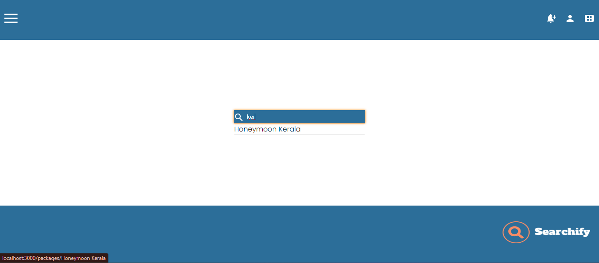
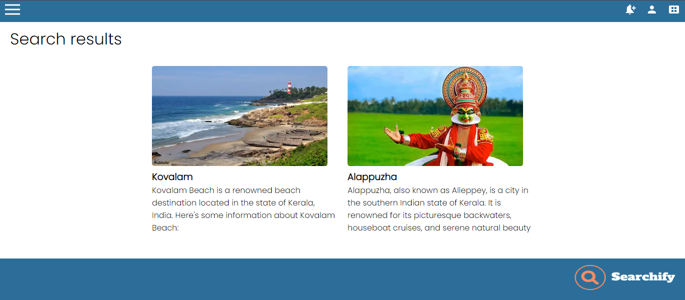

# Searchify

Searchify is a Next.js 14 application designed to search a keyword in a data source, such as Contentful, using the GraphQL API. It provides autocomplete functionality and displays search results on a new page.

## Getting Started

First, ensure you have set up your environment by creating a `.env.local` file. You can refer to the `.env` file added to this repository for reference.

```bash
# Example .env.local file
{
    CONTENTFUL_API_KEY=your-contentful-api-key
    CONTENTFUL_ENDPOINT=your-contentful-graphql-endpoint
}
```

Next, install dependencies and run the development server:

```
npm install
npm run dev
# Or
yarn install
yarn dev
# Or
pnpm install
pnpm dev
# Or your preferred package manager
```

Open http://localhost:3000 with your browser to see the result.



